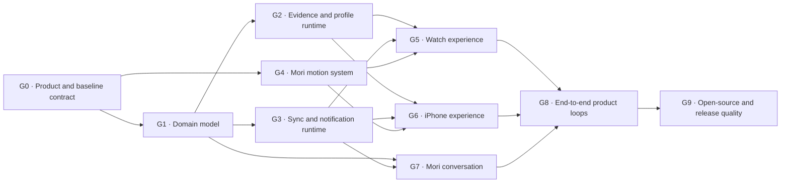

# Mori Product Rebuild Goal Plan

## Objective

Complete the approved Mori product across Apple Watch and iPhone:

- author complete black-penguin and white-polar-bear motion systems;
- replace the card-heavy Watch and iPhone interfaces with the approved
  platform-native experience;
- introduce passive companion events, concise tasks, coins, shared memories,
  conversation, automatic cross-device synchronization, and isolated Mock
  profiles;
- close product, privacy, accessibility, performance, migration, testing, and
  open-source quality gaps;
- finish only when automated, visible Simulator, and required physical-device
  gates have honest evidence.

This is a goal-based plan. It has no week or date estimates. Work advances only
when a goal's acceptance gate passes.

## Execution Model

Every goal moves through the same states:

1. **Contract ready** — behavior, boundaries, migration, and tests are defined.
2. **Implemented** — production code and assets exist without placeholder paths.
3. **Automated verified** — format, static checks, and scoped tests pass.
4. **Visually verified** — relevant Simulator journeys pass through Computer Use.
5. **Reviewed** — an independent review finds no unresolved P0/P1 issue.
6. **Committed** — only the goal's intended files are staged and committed.

Failure at any gate returns the goal to implementation. A later goal must not
weaken an already passed invariant.



## Git And Engineering Protocol

The execution branch is `codex/mori-product-rebuild`, created from
`51b9a58`.

- Use conventional commit prefixes: `docs`, `test`, `refactor`, `feat`, `fix`,
  and `chore`.
- Prefer small vertical commits that leave the branch buildable. Do not create
  one commit for the entire UI rewrite.
- Before staging, inspect `git status`, the scoped diff, generated files, and
  local Xcode state. Stage only files owned by the current goal.
- Never commit DerivedData, Simulator data, signing files, secrets, raw health
  samples, precise location data, or unsanitized screenshots.
- Run `Scripts/format`, scoped tests, and `Scripts/check` before each feature
  checkpoint. Run the full gate before completing a goal.
- Preserve unrelated user changes. Do not use destructive resets or force
  operations to clean the worktree.
- Public types and non-obvious policy decisions receive concise documentation.
  Prefer small value types, protocol boundaries, dependency injection, and pure
  reducers over global state and feature-wide stores.
- Keep SwiftUI views declarative. Root stores own lifecycle and dependency
  injection; feature models own feature state; domain rules stay outside views.
- New third-party code or assets require license review and
  `THIRD_PARTY_NOTICES.md` updates before merge.

Recommended checkpoint sequence:

```text
docs(product): freeze Mori rebuild contracts
test(baseline): record rebuild validation baseline
feat(core): add companion event task coin and memory ledgers
feat(runtime): isolate real and mock experience profiles
feat(sync): synchronize derived experience events
feat(motion): add complete Mori motion catalog
feat(watch): rebuild passive companion experience
feat(iphone): rebuild Mori today memories and collection
feat(chat): add authority-bounded Mori conversation
test(e2e): verify Mori cross-device product loops
chore(release): close accessibility privacy and open-source gates
```

These are checkpoint themes, not a requirement to force unrelated changes into
exactly ten commits.

## G0 — Product, Design, And Baseline Contract

### Deliverables

- `PRODUCT.md` and `DESIGN.md` as the strategic and visual source of truth.
- This goal plan.
- A route map for every Watch and iPhone destination.
- A state matrix for loading, ready, empty, partial permission, denied, stale,
  offline, invalid Mock, sync waiting, and destructive reset.
- Repository-owned copies of the approved Image2 references, their source
  prompts, and behavior annotations under
  `Design/WatchCompanionAssets/references/approved-mori-rebuild/`. Any newly
  introduced surface is reviewed with Image2 before implementation.
- A keep/move/replace/remove decision for every existing screen and domain
  feature.
- `docs/mori-rebuild-status.md` recording each Goal state, revision, automated
  evidence, Computer Use evidence, independent review, external blocker, and
  next action.
- An external capability audit recording available iPhone and Watch hardware,
  pairing, signing, test accounts, permission state, Focus/background test
  availability, and whether a second device is available for Touch Exchange.
- ADRs for:
  - passive inference and confidence policy;
  - real/Mock profile isolation;
  - derived experience-event synchronization;
  - chat authority and fact provenance;
  - legacy growth/story migration.
- An updated privacy contract before conversation work begins: remote Chat and
  narration receive only approved derived facts and memory references. Existing
  documentation that allows raw health samples to leave the device is removed.
- A fresh validation baseline from the current branch.

### Fixed Product Decisions

- Watch home is a passive full-screen scene and never displays tasks, levels,
  vitality, XP, health cards, trends, coin balance, or sync controls.
- iPhone tabs are `Mori`, `今天`, `回忆`, and `收藏`; Settings opens from a gear.
- A real-world event may create at most one task. Same-type tasks use a
  deterministic cooldown.
- Reliable tasks complete automatically. Tasks the system cannot reliably
  observe allow explicit user confirmation.
- Coin rewards use integer tiers `+1`, `+2`, `+4`, and `+6...10` for rare
  one-time story moments. There is no daily coin cap.
- Health outcomes never lose coins, block access, or cause streak punishment.
- Event confidence remains internal. Exact facts are direct, high-confidence
  interpretations are natural, medium confidence is tentative, and low
  confidence is silent.
- A new event enters `pending` with
  `presentationEligibilityDeadline = observedAt + 2 minutes`. It may be consumed
  once on the next foreground activation. Presentation is a brief glance, not a
  two-minute bubble. It then becomes `presented`; an elapsed deadline becomes
  `expired`; a newer event marks the older pending event `replaced`. There is no
  queue. Reminder state and daily-memory eligibility are separate.
- The daily memory becomes available after 22:00. Notification delivery is
  best-effort rather than guaranteed at an exact minute. Default quiet hours are
  `22:30–07:00`.
- `抬腕提醒` means “show on the next foreground activation”; implementation must
  not claim access to a guaranteed wrist-raise event.
- Settings and experience events synchronize automatically. There is no manual
  sync, sync test, or simulated sync-failure product control.
- Persistence uses three explicit namespaces:
  - `GlobalSyncedPreferences`: `activeProfileSelection`, `mockScenarioID`,
    companion sensing, reminder mode, and quiet hours. Every change carries a
    monotonic `PreferenceRevision`, `effectiveAt`, and stable origin device ID;
  - `DeviceCapabilities`: actual HealthKit, location, motion, notification, and
    background capability on the current device; capabilities are never synced
    as if they were permissions on the peer;
  - `ProfileState`: tasks, coins, collection, memories, letters, conversation,
    and experience ledgers; real and Mock profiles are strictly isolated.
- Turning off `Mori 随行` immediately stops new passive evidence collection and
  inference, clears pending reminders, and prevents passive tasks and memories.
  Existing records remain. Re-enabling never backfills the disabled interval.
  The home may continue to show already permitted current step and sleep facts,
  because those facts are independent of companion inference.
- A device changing `Mori 随行` stops its local adapters immediately. Every
  passive evidence and derived event carries the active companion-sensing
  generation. When an offline peer later receives the disabling revision, it
  rejects post-`effectiveAt` events from the superseded generation and never
  merges or backfills them. Concurrent changes resolve by the highest logical
  revision and then stable origin-device ID; wall-clock rollback cannot win over
  the logical revision.
- `mockScenarioID` synchronizes with the active profile selection. A Mock
  `ProfileState` records both `profileID` and `seededFromScenarioID`. Changing
  scenario creates a new Mock generation, resets and deterministically reseeds
  only Mock state, and explains that reset in the selection UI. Offline
  conflicting selections use the same revision rule; losing-generation events
  are discarded and real state is untouched.
- Watch Today shows one recommendation and at most two secondary tasks. iPhone
  Today shows one recommendation and at most three secondary tasks. Lower-ranked
  automatic tasks may complete while collapsed; a manual-confirmation task must
  receive a visible slot before it can be issued. Cooldown starts at issuance
  using the task's stable cooldown key.
- The daily memory has one deterministic ID per profile, local day, and time
  zone. The shared reducer composes and seals one record after 22:00. The iPhone
  is the only paired notification-scheduling authority; Watch renders the synced
  record and never persists a competing fallback. If the phone is absent, Watch
  may show a transient “正在整理” state but cannot mark it saved. Sealed memories
  are not silently rewritten by late evidence.
- The current Goal supports Simplified Chinese user-facing copy. Strings remain
  localization-ready; English copy is outside this Goal.
- There are no formal users. This rebuild performs one versioned development
  data reset for the obsolete level/vitality/fixed-story schema instead of
  carrying a long-lived compatibility layer.

### Legacy Decisions

| Existing capability | Decision |
| --- | --- |
| Event ledger, deterministic reducers, replay | Keep and extend |
| Health missing/stale neutrality | Keep |
| Notification budget, quiet hours, cooldown | Keep and adapt |
| WatchConnectivity outbox and retry | Keep and extend |
| Touch Exchange privacy state machine | Keep; move its entry |
| Wardrobe preview/equip flow | Keep; adapt into Collection |
| Fixed seven-day main story | Deprecate and migrate out |
| Level, XP, vitality, bond, insight | Remove through the versioned development reset; do not rename them to coins |
| Health-centered trend dashboard | Remove from primary UI |
| Existing `StoryState.memories: [String]` | Replace with structured memory records |
| Home data-source selectors | Move to Settings |

### Acceptance Gate

- Every old surface has a recorded decision.
- `Scripts/check`, `Scripts/test`, `Scripts/test-release-boundaries`, and the
  existing E2E suite have a fresh PASS or an exact baseline failure record.
- The known release-boundary `mock1` conflict is resolved before feature
  migration begins.
- `GlobalSyncedPreferences`, `DeviceCapabilities`, and `ProfileState` have
  separate schemas and testable ownership.
- The `Mori 随行` off/on behavior, Today visibility rules, daily-memory
  authority, privacy contract, and development reset are represented in tests.
- The external capability audit is complete. Missing hardware is recorded as
  `UNVERIFIED`, not treated as an implementation failure or a simulated pass.
- No unverified physical capability is reported as passing.

## G1 — Authoritative Product Domain

### Deliverables

Add versioned, Codable, Sendable domain types and pure policy engines:

- `PassiveCompanionEvent`
  - stable event ID;
  - profile ID;
  - event type and observed time;
  - internal confidence band and evidence references;
  - presentation eligibility deadline, replacement key, and task cooldown key;
  - `pending`, `presented`, `expired`, or `replaced` reminder state independent
    of durable memory eligibility.
- `TaskInstance`
  - source event ID;
  - recommendation priority;
  - automatic or user-confirmed completion policy;
  - lifecycle state and expiry;
  - reward tier and idempotent settlement ID.
- `CoinTransaction`
  - earn, spend, reversal, and migration reasons;
  - stable transaction ID;
  - non-negative balance projection.
- `MemoryRecord`
  - local day and time zone;
  - structured fact references;
  - approved narrative text;
  - scene and Mori action identifiers;
  - deletion and provenance metadata.
- `ConversationRecord`
  - role, content, local time, referenced memories, and deletion state;
  - no embedded raw health or location payload.
- `LetterRecord`
  - source event or memory reference;
  - stable ID, delivery time, read state, deletion state, and sync revision;
  - an Inbox projection shared by Watch and iPhone.
- `RuntimeProfile`
  - real profile and isolated Mock profile identifiers for `ProfileState`;
  - Mock source scenario and profile generation;
  - companion-sensing generation on passive evidence;
  - deletion generation that invalidates every earlier profile event;
  - no device capability or global data-mode selection.
- `ExperienceSyncEnvelope`
  - version, profile, event ID, revision, tombstone, and payload.
- Query projections for Watch Home, Today, Daily Memory, iPhone Today,
  Memories, Collection, and Chat context.

### Required Invariants

- One real-world event creates zero or one task.
- Replaying, reordering, or duplicating events does not duplicate tasks,
  memories, or coins.
- Automatic completion and user confirmation racing each other settle once.
- Coin rewards have no daily cap and follow the approved integer tiers.
- Spending cannot produce a negative balance.
- Same-type task cooldowns are deterministic across restart, midnight, time-zone
  change, daylight-saving change, and clock rollback.
- Missing or revoked sensor data is neutral.
- Low-confidence evidence produces no user-visible claim.
- Chat cannot create facts, complete tasks, award coins, purchase cosmetics,
  change permissions, or bypass a rule engine.
- Mock and real timelines never merge.
- Turning companion sensing off produces no passive event, task, memory, or
  pending reminder during the disabled interval and never backfills it.
- Letters converge across read, delete, duplicate, offline, and relaunch paths.
- Preference and profile generations reject offline evidence, Mock state, or
  deleted state created under a losing or superseded generation.

### Test Gate

- Unit tests for every reducer and policy.
- Fixed migration fixtures for every schema introduced by this rebuild.
- At least 1,000 deterministic timeline seeds covering duplicates, late events,
  midnight, time zones, cooldowns, expiry, restart, and profile isolation.
- Explicit negative and counterexample tests for settlement and privacy
  invariants. A mutation-testing threshold is added only if the repository
  adopts a concrete mutation tool.

## G2 — Evidence, Inference, And Profile Runtime

### Deliverables

- Normalize HealthKit, Core Motion, coarse location, foreground activation, and
  user interaction into evidence records behind Apple adapter protocols.
- Implement the on-device inference pipeline:

  ```text
  evidence -> candidate -> confidence policy -> cooldown/replacement policy
  -> passive event -> optional task -> memory eligibility
  ```

- Implement `ProfileState` repositories for real and Mock as separate storage
  namespaces while keeping `GlobalSyncedPreferences` and local
  `DeviceCapabilities` separate.
- Make reset delete only the selected Mock profile.
- Persist only necessary derived facts and provenance; never persist a precise
  route by default.
- Define capability budgets for sampling frequency, animation activity,
  background work, memory, and battery.
- Provide deterministic Mock scenarios for normal day, fast walking,
  walk-and-stop, late sleep, denied permission, stale evidence, and offline
  synchronization.

### Acceptance Gate

- Mock mode does not construct or read production HealthKit/location adapters.
- Switching profiles cannot expose the other profile's tasks, coins, memories,
  letters, conversation, collection state, or event ledger. Global reminder
  preferences remain shared by design; device capabilities remain local.
- Resetting Mock cannot mutate real state.
- Switching Mock scenario creates one new seeded Mock generation on both devices;
  offline conflicting selections converge and losing-generation events are
  rejected.
- Confidence and evidence remain available for diagnostics without appearing as
  a user-facing percentage.
- Raw GPS tracks and raw HealthKit samples never enter logs, chat context,
  memories, or sync envelopes.
- Disabling companion sensing while the peer is offline rejects the peer's
  superseded-generation passive evidence on reconnection.
- Simulator tests prove deterministic application behavior; physical capability
  claims remain unverified until the device runbook passes.

## G3 — Automatic Sync, Reminder, And Daily Memory Runtime

### Deliverables

- Synchronize `GlobalSyncedPreferences`; observe actual authorization and
  background capabilities from `DeviceCapabilities` on each device.
- Add a versioned derived `ExperienceEvent` outbox and merge path separate from
  preference synchronization.
- Synchronize task issuance/completion, coin transactions, cosmetic purchases,
  memory records, and approved derived companion events.
- Add reminder preferences:
  - `随行感知`;
  - `抬腕提醒`;
  - `轻震提醒`;
  - editable quiet hours.
- Add the pending-event state machine: eligible for the next activation for two
  minutes, present once, expire, or be replaced by the newest event.
- Compose one deterministic sealed daily-memory record and let iPhone own paired
  notification scheduling. Watch never schedules a duplicate notification.
- Keep notification opening navigational only; it never settles a reward.

### Acceptance Gate

- Offline Watch events merge after reconnection.
- Duplicate, delayed, reordered, and repeated envelopes converge.
- Simultaneous completion on both devices settles one reward.
- Profile mismatch fails closed.
- Sync failures retry in the background without a home-screen control.
- New events replace pending old events; a presented glance is consumed and
  cannot repeat on every activation. No hidden notification queue grows.
- Quiet hours suppress haptics and notifications according to policy.
- Daily memory is still accessible when notification delivery is delayed or
  suppressed.
- Late evidence cannot duplicate or silently rewrite a sealed daily memory.

## G4 — Complete Mori Motion System

### Identity Contract

- `penguin` is the black Mori identity.
- `polar_bear` is the white Mori identity.
- They share semantic action IDs but retain independent silhouette, face,
  proportions, palette, markings, materials, and motion personality.
- Neither identity is a recolor, mirrored body replacement, or deformation of
  the other.

### Approved Foundation Atlas For Each Identity

The existing black-penguin and white-polar-bear hatch-pet v2 masters are the
identity baseline. Preserve every approved row and look direction that still
passes deterministic and visual QA. Regenerate only a complete failing row or a
new product clip; do not redraw the foundation by default.

Each preserved identity continues to pass:

- `192x208` cells;
- 8 columns × 11 rows;
- `idle`, `running-right`, `running-left`, `waving`, `jumping`, `failed`,
  `waiting`, `running`, and `review`;
- 16 clockwise look directions with unambiguous cardinals;
- `1536x2288` PNG/WebP atlas;
- `spriteVersionNumber: 2`;
- deterministic extraction, despill, atlas validation, motion previews,
  direction semantics, blind direction QA, continuity QA, and independent visual
  review.

The v2 atlas is the stable authoring and identity package. It is not a
requirement to load all 16 directions into Watch memory. The runtime exporter
produces only product-triggered frames from one canonical source of truth.

### Product Motion Catalog For Each Identity

Every catalog entry is classified as `uniqueClip`, `alias`, `poseOnly`, or
`policyOnly`. Semantic parity means the black and white Mori communicate the
same state at equal quality; it does not require a redundant eight-frame clip
when an approved alias or pose is clearer.

The current runtime aliases are structural placeholders, not approved emotional
semantics. In particular, `touch_body -> failed`, `idle_lively -> waving`, and
`story_reaction -> review` must not survive as final mappings.

| Group | Semantic action | Production form |
| --- | --- | --- |
| Existing runtime | `idle_neutral` | preserve or refine the approved idle clip |
| Existing runtime | `idle_resting`, `idle_curious`, `idle_lively` | dedicated semantic loops; stop aliasing waiting, review, and waving |
| Existing runtime | `touch_head`, `touch_body` | dedicated happy/turning touch reactions; never alias failure |
| Existing runtime | `action_success` | dedicated success clip shared by task and coin settlement |
| Existing runtime | `story_reaction` | dedicated listening/affected reaction; never alias generic review |
| New movement | `walk`, `brisk_move`, `sit_down`, `catch_breath` | required unique clips; brisk movement does not claim to distinguish fast walking from running |
| New relationship | `route_reflection`, `speaking`, `daily_reflection`, `bedtime` | required unique clips |
| Approved aliases | `greeting` | hatch waving or an approved one-shot waving variant |
| Approved aliases | `reward_found`, `task_completed` | `action_success`; coin remains native UI, never baked into frames |
| Approved aliases | `memory_opened` | `story_reaction` or `daily_reflection`, selected by scene |
| Approved aliases | seated continuous state | `idle_resting` after the `sit_down` transition |
| Pose-only | menu appearance | stable `idle_curious` key frame or gaze toward the menu |
| Pose-only | bubble, step, sleep, and directional attention | approved v2 look direction at product size |
| Policy-only | reminder eligibility, replacement, cooldown, confidence, rewards, scheduling, interruption, return to idle | domain or motion-scheduler metadata, never a sprite |

Hatch `failed` is never used to judge a missed health or task outcome. Hatch
non-directional `running` means “processing” and is never relabeled as evidence
that the user is running.

Do not author a unique animation for every sentence. Events select a semantic
action plus scene and copy. The same action ID is used by Watch and iPhone.

### Motion Metadata

Every semantic action declares:

- production form: unique clip, alias, pose-only, or policy-only;
- single authoritative product trigger and surfaces allowed to render it;
- interruption and return-to-idle policy;
- optional haptic category;
- hit-test behavior;
- VoiceOver or visible alternate action;
- priority, allowed interrupters, and whether the action may run on Watch;
- clothing/accessory occlusion compatibility for both identities.

`uniqueClip` additionally requires asset key, ordered frames, fps, loop/one-shot
behavior, anchor, scale, and Reduce Motion key frame. `alias` requires a target
ID plus allowed context. `poseOnly` requires a source pose and hold behavior.
`policyOnly` has no sprite fields.

Replace the expanding hard-coded animation switch with a data-driven
`MotionCatalog`. Missing or invalid motion data fails to a neutral idle without
crashing.

### Asset Acceptance Gate

- Black and white identities have complete semantic parity.
- Existing approved foundation rows remain unchanged unless a recorded QA
  failure requires complete-row repair.
- No identity drift, cropping, body-scale pop, baseline jump, transparent
  interior seam, chroma contamination, detached effects, reversed gait, or wrong
  direction.
- Contact sheets and previews are reviewed at actual in-app size.
- Reduced Motion, missing-frame fallback, and interruption behavior pass.
- Each `uniqueClip` and `poseOnly` entry has readable emotional and motion intent
  within roughly 300–500 ms at actual Watch display size. An alias may depend on
  its scene and native UI to distinguish the specific event. `policyOnly`
  entries do not participate in visual readability QA.
- `Scripts/validate-visual-assets` validates all production assets and becomes a
  required CI gate.
- Watch Simulator proves correct composition on small and large displays.
- Physical Watch evidence records frame pacing, memory, thermal behavior,
  battery impact, and haptic feel.
- G4 chooses and documents one scalable cosmetic strategy—layered overlays,
  explicitly bounded pre-rendered combinations, or collection-only previews—so
  clothing does not multiply every action asset without limit.

## G5 — Apple Watch Experience

### Deliverables

- Full-bleed Watch Home:
  - Mori in the scene;
  - last completed sleep at upper left;
  - steps at lower right;
  - `Mori 随行中` at the bottom.
- Event presentation:
  - semantic Mori action;
  - one compact speech bubble;
  - pending for at most two minutes before the next activation;
  - one brief presentation followed by consumption;
  - next event replaces the current pending event.
- Tap `Mori 随行中`:
  - companion sensing toggle;
  - reminder mode;
  - quiet hours.
- Long press Mori:
  - `今天`;
  - `Mori 来信`;
  - `碰一碰`;
  - `设置`.
- `今天`:
  - one recommended task;
  - at most two visible secondary tasks;
  - clear automatic versus user-confirmed completion;
  - gold coin rewards.
- Daily Memory:
  - immersive scene;
  - approved step and sleep facts;
  - relationship-led narrative.
- Special Settings:
  - data mode;
  - Mock scenario;
  - reset selected Mock profile.
- Preserve and relocate the existing Messages and Touch Exchange flows.
- Render `LetterRecord` read/unread/delete state rather than deriving Inbox state
  inside the view.

### Architecture

- Split the current giant root into feature views and feature presentation
  models.
- Keep root store responsibilities to lifecycle, routing, and injected use
  cases.
- Render query projections; views do not interpret the event ledger.
- Move data-source controls and diagnostic explanations out of Home.
- Remove card-first design-system usage from primary Watch surfaces.

### Acceptance Gate

- Home contains none of the prohibited dashboard or progression UI.
- Tap and long press do not conflict; repeated touch is debounced.
- Long press has an accessibility action or visible alternative.
- 40 mm and largest supported Watch layouts pass without clipping.
- VoiceOver, Reduce Motion, large text, increased contrast, and non-haptic use
  pass.
- New Watch UI tests cover navigation, event replacement, expiry, tasks,
  memory, settings, profile reset, notification routing, and relaunch.
- Turning `Mori 随行` off clears pending reminders, creates no passive task or
  memory, keeps existing records, and performs no later backfill.
- After automated tests, Computer Use visibly verifies every primary path and
  records sanitized screenshots.

## G6 — iPhone Experience

### Deliverables

- New root tabs:
  - `Mori`;
  - `今天`;
  - `回忆`;
  - `收藏`.
- Gear-driven Settings, never a fifth tab.
- `Mori`:
  - scene header and conversation;
  - text input;
  - optional proposal to add one activity to Today;
  - no task list or coin balance.
- `今天`:
  - one dominant recommendation;
  - at most three visible secondary tasks;
  - explicit automatic/manual semantics;
  - completed count and today's memory.
- `回忆`:
  - chronological shared-memory timeline;
  - imagery and relationship prose first;
  - step and sleep facts secondary;
  - deletion behavior and empty states.
- `收藏`:
  - coin balance;
  - clothing, accessory, and scene categories;
  - purchase, equip, locked, owned, offline, and insufficient-balance states;
  - cosmetics never modify health or task rules.
- Settings:
  - data and permissions;
  - conversation memory and clear-history controls;
  - data mode, Mock scenario, and Mock reset;
  - friend sharing and public-pet-state controls required by Touch Exchange;
  - a destructive `删除所有 Mori 数据` flow covering every real and Mock profile,
    conversation, memory, coin, outbox, cache, and social state;
  - automatic Watch synchronization note without manual sync UI.

### Architecture

- Replace `overview/history/wardrobe/privacy` as root tabs without discarding
  reusable wardrobe, privacy, and Touch Exchange logic.
- Create feature-specific presentation models and route-safe query projections.
- Use native navigation, lists, segmented controls, timelines, and sheets.
- Keep only the recommended task as a bounded highlighted object. Secondary
  tasks are rows.

### Acceptance Gate

- Tabs, deep links, state restoration, and notification routes resolve correctly.
- Mori Home never becomes a task dashboard.
- Memories read as shared life, not exercise history.
- Coin purchase and equip flows are idempotent across offline/retry/relaunch.
- Full-data deletion increments a durable `profileDeletionGeneration`, rejects
  every older-generation event, clears the obsolete profile and its old outbox,
  then enqueues an independently persisted deletion marker that remains until
  every reachable peer acknowledges it. A previously offline peer cannot restore
  deleted state after reconnection.
- Light, dark, high contrast, Dynamic Type AXXXL, VoiceOver, Reduce Motion,
  loading, empty, denied, stale, offline, and error states pass.
- Updated UI tests avoid implementation hierarchy and use stable semantic
  identifiers.
- Computer Use visibly verifies primary journeys on at least one small and one
  large supported iPhone destination.

## G7 — Authority-Bounded Mori Conversation

### Deliverables

- Local conversation repository with clear-history behavior.
- Optional use of approved shared memories as context.
- Keep the existing bounded `/v1/narrations` contract for one-shot memory prose.
  Introduce a separately versioned Chat contract for multi-turn conversation;
  do not silently overload narration responses.
- A bounded conversation window consisting of recent messages plus a local
  redacted summary, with explicit retention and deletion policy.
- Provider, timeout, cancellation, rate, and cost budgets defined in
  configuration rather than UI code.
- Client authentication obtained through the existing secure runtime
  configuration boundary; credentials never ship in source, fixtures, prompts,
  logs, or screenshots.
- Prompt-injection handling and an explicit tool whitelist. Chat receives no
  state-mutating tool; a proposed task is parsed into an untrusted candidate and
  revalidated by the rule engine.
- A local deterministic fallback that can acknowledge the user, show approved
  memories, and explain offline status, but cannot pretend to generate a new
  sensor interpretation.
- Structured assistant responses that may:
  - discuss user-provided content;
  - reference approved memory facts;
  - explain why Mori reacted;
  - propose a task candidate for rule-engine approval.
- Safety and authority enforcement outside the model.
- Streaming, timeout, cancellation, retry, offline, malformed, and oversize
  response states.

### Acceptance Gate

- The model cannot directly persist a sensor fact.
- The model cannot mark a task complete, award/spend coins, equip an item,
  change permissions, schedule a notification, or mutate authoritative state.
- Clearing conversation and deleting a shared memory have distinct, tested
  effects.
- Disabling shared-memory context prevents it from appearing in future prompts.
- Rate, timeout, provider-failure, malformed, oversized, cancellation, and
  prompt-injection tests pass.
- Logs and audit records contain no raw health, precise location, secrets, or
  full private prompt payloads.
- Network-disabled mode still provides a coherent local Mori experience.
- Microphone and speech-recognition functionality are outside this Goal unless
  separately approved with a permission and privacy contract.

## G8 — Complete Product Loops

### Required End-To-End Journeys

1. Walking evidence → passive event → short Watch bubble → recommended task →
   automatic or user-confirmed completion → one coin transaction → Collection
   purchase.
2. Daytime evidence → structured daily memory → best-effort notification →
   Watch memory scene → iPhone memory timeline → allowed Chat reference.
3. Event generated offline on Watch → app termination → reconnect → idempotent
   iPhone merge.
4. Same task completed on both devices → one settlement.
5. Switch to Mock → generate tasks, coins, and memories → reset Mock → return to
   untouched real state.
6. Permission denied/revoked → neutral Mori fallback → settings guidance →
   experience remains playable.
7. Quiet hours and reminder modes → visual-only, haptic, suppressed, expired,
   and replacement behavior.
8. Character switch → black and white Mori preserve the same semantic state and
   continue the same product journey.

### Acceptance Gate

- Full state counts agree across ledger, projections, Watch, and iPhone.
- Restart, disconnect, duplicate input, late input, and clock changes produce no
  duplicate reward or ghost task.
- Existing Touch Exchange privacy and cancellation tests remain green.
- Ten consecutive Simulator E2E runs pass on the same revision as a flake
  audit, with seed and failure attribution recorded. This complements rather
  than replaces the state matrix and device gates.
- A second clean-install Computer Use run reproduces the primary transitions.

## G9 — Accessibility, Privacy, Performance, Open Source, And Release Quality

### Performance Budgets

Measure the current physical-device baseline in G0, then enforce both absolute
and regression thresholds:

- foreground Mori motion targets 10 fps; at least 95% of frame intervals remain
  at or below 150 ms and no unexplained stall exceeds 500 ms in the scripted
  motion run;
- decoded active scene plus character-frame cache remains at or below 24 MiB;
- compressed production motion assets remain at or below 25 MiB per identity;
- foreground CPU/energy remains within 15% of the recorded static-scene baseline
  on the same device and OS, with no thermal-state escalation during the
  30-minute scripted run;
- inactive and Always On states stop sub-second animation timers and render a
  semantic static frame;
- exceeding a budget triggers a documented downgrade such as smaller cache,
  reduced cadence, or static key frame before release.

If an initial measured baseline makes a threshold technically invalid, revise
the budget in an ADR before implementation rather than silently waiving it.

### Automated Gate

All relevant commands pass from a clean checkout:

```text
Scripts/bootstrap
Scripts/format
Scripts/check
Scripts/test
Scripts/test-release-boundaries
Scripts/test-e2e
Scripts/test-accessibility
Scripts/validate-visual-assets
```

CI runs static checks, packages, adapter tests, UI E2E, release boundaries,
accessibility, and visual-asset validation with appropriate separation.

- Python service dependencies are locked with reproducible versions and hashes;
  bootstrap does not silently upgrade the toolchain on every run.
- Visual provenance stored in tracked manifests is repository-relative. Local
  `/Users/...` and `.codex/generated_images/...` paths are removed from
  production manifests.
- `Scripts/format` is followed by a scope check. Unexpected files are reverted
  through an intentional patch rather than included in an unrelated commit.
- CI uploads accessibility and visual-validation artifacts on failure.

### Computer Use Gate

After automation is green, use the Computer Use runtime to operate Xcode and
Simulator visibly:

- launch the actual iPhone and Watch schemes;
- perform taps, long presses, task confirmation, purchase, reset, settings,
  conversation, memory, and notification navigation;
- inspect current accessibility text after every state change;
- capture sanitized screenshots for the reviewed destinations;
- verify loading, empty, denied, stale, offline, invalid Mock, and relaunch
  states;
- record destination, OS, scenario, revision, expected result, observed result,
  and evidence path in `docs/validation-status.md`.

Shell-built screenshots or passing UI tests do not replace this gate.
Computer Use proves visible functional journeys. VoiceOver ordering, accessible
names, traits, and contrast remain separately verified by XCUITest audits,
Accessibility Inspector or AX hierarchy evidence; visual operation alone cannot
claim them.

### Physical Device Gate

Follow `docs/device-runbook.md` and keep each result `UNVERIFIED` until observed:

- HealthKit real samples and background delivery;
- location and motion background behavior;
- notification delivery under Focus and quiet conditions;
- visual-on-activation behavior;
- haptic feel and suppression;
- Watch/iPhone disconnect and recovery;
- animation frame pacing, memory, thermal behavior, and battery impact.

If Apple platform constraints prevent a promise, change the product claim and
document the fallback instead of simulating a pass.

### Documentation And Open-Source Gate

Update and reconcile:

- `README.md`;
- `docs/product-rules.md`;
- `docs/architecture.md`;
- `docs/privacy.md`;
- `docs/testing.md`;
- `docs/device-runbook.md`;
- `docs/visual-assets.md`;
- `docs/validation-status.md`;
- relevant ADRs;
- `CHANGELOG.md`;
- `CONTRIBUTING.md`;
- `SECURITY.md`;
- `THIRD_PARTY_NOTICES.md`.

Verify:

- no secrets or signing state;
- no raw personal health/location fixtures;
- generated asset provenance and license compatibility;
- reproducible locked Python and Swift dependencies;
- reproducible bootstrap and validation commands;
- stable public schemas and documented migrations;
- comments explain policy and invariants rather than restating code;
- no dead legacy feature remains reachable;
- the final Git history is reviewable and each checkpoint is independently
  buildable.
- each Goal's independent review record includes reviewer, revision, findings,
  dispositions, and final P0/P1 status.

## Additional Product And Engineering Risks

- watchOS does not guarantee continuous background location, exact wrist-raise
  observation, Always On animation, notification delivery time, or haptic
  delivery. Product wording and fallback behavior must remain truthful.
- Full-screen 10 fps animation, location inference, and background processing
  share one Watch energy budget.
- A short-lived bubble and a durable memory have different lifecycles.
- Time zones, daylight-saving changes, midnight boundaries, clock rollback, and
  late HealthKit samples affect task, coin, and memory grouping.
- Permission revocation, conversation clearing, memory deletion, profile reset,
  and whole-app data deletion are separate operations.
- No formal account does not remove the need for local deletion, schema
  migration, cross-device conflict resolution, or privacy documentation.
- Long press and haptics cannot be the only way to access a function or perceive
  state.
- Chat-generated prose needs fact provenance, safety limits, cancellation, and a
  complete offline fallback.
- Development Mock controls must be feature-gated before any future public
  release, even though they remain visible in the current evaluation product.
- Large image catalogs require an asset-size budget, lazy loading, decoded-image
  memory checks, and fallback behavior for missing files.
- Chinese copy, date boundaries, pluralization, truncation, and accessibility
  reading order need dedicated localization tests.
- Observability must record rule and sync outcomes without recording private raw
  sensor data or precise routes.

## Definition Of Goal Complete

Track three completion axes:

- `IMPLEMENTATION_COMPLETE`: production code, assets, migrations, automated
  tests, documentation, and independent review pass.
- `SIMULATOR_VALIDATED`: required iPhone and Watch journeys and accessibility
  matrices pass on the recorded revision through automation and Computer Use.
- `DEVICE_VALIDATED`: every required physical-device runbook item passes.
- `DEVICE_PARTIAL`: some required hardware journeys pass but at least one is
  unavailable or incomplete.
- `DEVICE_UNVERIFIED`: no sufficient physical-device evidence exists.

Missing hardware or test windows do not erase implementation completion and are
never simulated into a pass.

The implementation Goal is complete only when:

- every goal above is in the **Committed** state;
- black and white Mori have complete validated motion parity;
- approved Watch and iPhone journeys are implemented with no prohibited legacy
  UI;
- passive events, tasks, coins, memories, Chat, profiles, and synchronization
  satisfy their domain invariants;
- automated and Computer Use evidence is recorded honestly;
- all known P0/P1 findings are resolved;
- the worktree is clean and the final branch history is reviewable;
- documentation describes the product that actually runs.

The final report states the implementation axis, Simulator axis, and one of the
three device statuses. It claims `DEVICE_VALIDATED` only when
the external capability audit and physical runbook provide evidence for every
required hardware-dependent behavior.
